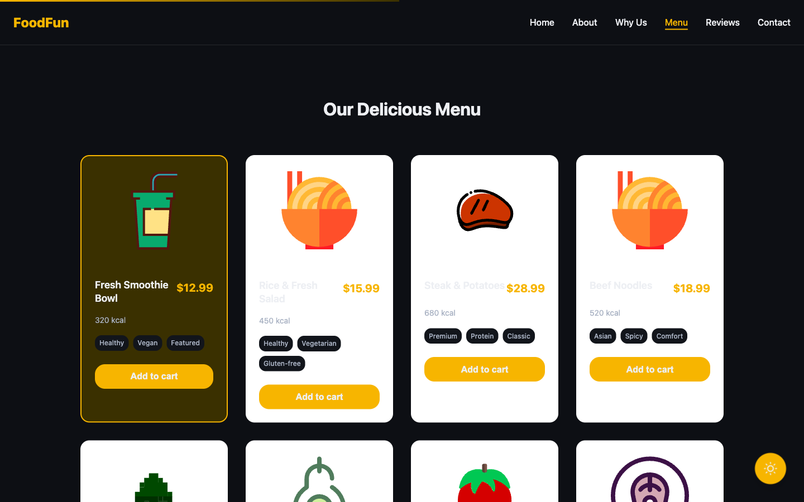
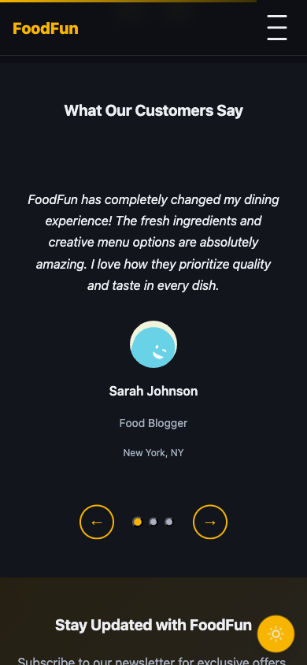

**Live Demo → https://mutlukurt.github.io/foodfun/**
  

# FoodFun — Restaurant Landing (Vite + Vanilla JS)

Modern, accessible, dark/light, responsive, menu carousel, testimonials, newsletter, localStorage.

## Table of Contents

- [Live Demo](#live-demo)
- [Features](#features)
- [Tech Stack](#tech-stack)
- [Screenshots](#screenshots)
- [Getting Started](#getting-started)
- [Scripts](#scripts)
- [Project Structure](#project-structure)
- [Design Tokens](#design-tokens)
- [Accessibility](#accessibility)
- [Performance](#performance)
- [Deployment](#deployment)
- [Changelog](#changelog)
- [Troubleshooting](#troubleshooting)
- [License](#license)

## Features

- [x] Single-page landing (Nav → Hero → About → Why Us → Menu → Testimonials → Newsletter → Footer)
- [x] Dark/Light mode (persisted with localStorage)
- [x] Sticky navbar + mobile hamburger (body scroll-lock)
- [x] Menu carousel (cards with CTA, scroll-snap on mobile)
- [x] Testimonials slider (auto-play, pause on hover/focus, keyboard arrows)
- [x] Toast system (add-to-cart, subscribe)
- [x] Scroll reveal (IntersectionObserver, motion-safe)
- [x] Responsive 320–1440px
- [x] A11y: focus-visible rings, alt text, tap targets ≥ 44px
- [x] Performance polish: pre-sized images, lazy-loading
- [x] SEO: meta/OG/manifest, favicon
- [x] GitHub Pages deployment

## Tech Stack

- **Vite** (base-aware config), **Vanilla JS** modules, **modern CSS** (custom properties, clamp(), aspect-ratio)
- No UI libs; all components custom
- **Dev Dependencies:**
  - `gh-pages` ^6.3.0
  - `vite` ^5.0.0

## Screenshots

### Row 1: Light vs Dark Hero
 (TODO)
 (TODO)

### Row 2: Menu Cards + Testimonials
 (TODO)
 (TODO)

## Getting Started

```bash
npm i
npm run dev
npm run build && npm run preview
```

## Scripts

| Script | Description | Command |
|--------|-------------|---------|
| `dev` | Start development server | `npm run dev` |
| `build` | Build for production | `npm run build` |
| `preview` | Preview production build | `npm run preview` |
| `deploy` | Deploy to GitHub Pages | `npm run deploy` |
| `predeploy` | Build before deployment | `npm run predeploy` |

## Project Structure

```
/src/
├── components/
│   ├── About.js
│   ├── FloatingIngredients.js
│   ├── Footer.js
│   ├── Hero.js
│   ├── MenuCarousel.js
│   ├── NavBar.js
│   ├── Newsletter.js
│   ├── Testimonials.js
│   ├── ThemeToggle.js
│   └── Toast.js
├── styles/
│   ├── global.css
│   ├── components.css
│   ├── utilities.css
│   └── mobile.css
├── data/
│   ├── menu.json
│   └── testimonials.json
├── assets/
│   ├── plate-*.svg (12 dish plates)
│   ├── ing-*.svg (4 ingredients)
│   ├── avatar-*.svg (4 avatars)
│   ├── ic-*.svg (3 icons)
│   ├── hero.svg, favicon.svg
│   └── + more
├── utils/
│   └── assetsMap.js (assetUrl/assetsMap, prefersReducedMotion, storage helpers)
├── main.js
├── counter.js
└── javascript.svg
├── vite.config.js
├── index.html
└── README.md
```

## Design Tokens

### Colors
- **Light:** `--brand: #F7B500`, `--brand-2: #FFE08A`, `--text: #1B1B1B`, `--muted: #6A6A6A`, `--bg: #FFFFFF`, `--bg-2: #FAFAFA`, `--radius: 18px`
- **Dark:** `--bg: #0D0F14`, `--bg-2: #12151B`, `--text: #EDEFF3`, `--muted: #A9B2C3`, `--brand: #F7B500`, `--brand-2: #3A3000`

### Typography
- **Display:** `clamp(28px, 3vw, 48px)/1.15 800`
- **H2:** `clamp(20px, 2.2vw, 32px)/1.2 700`
- **Body:** `16px/1.65`

## Accessibility Notes

- Keyboard-only nav tested, focus-visible rings, alt attributes
- Motion-safe: prefers-reduced-motion respected (hero floats, reveals)
- Tap targets: 44×44px hamburger, CTA buttons

## Performance Notes

- Images pre-sized (aspect-ratio), lazy for non-hero
- Modules tree-shaken, `<script type="module">`
- Target Lighthouse ≥ 90/90/90/90 — leave placeholders for scores and update later

## Deployment (GitHub Pages)

- Base path set to `/foodfun/` in vite.config.js
- Build → `dist/`
- **Options:**
  - **gh-pages script:** `gh-pages -d dist`
  - **or Pages Action** (summarize)
- **Note:** use incognito / hard refresh if CDN cache persists

## Changelog — What we fixed (detailed)

### 2025-08-18 — Assets & Paths Overhaul
- Moved images from `/public/assets` → `/src/assets`
- Introduced base-aware resolver with `import.meta.glob` (assetsMap.js) to bundle and hash all images → consistent URLs on localhost & GitHub Pages (incl. Safari)
- Replaced all string paths and `new URL(...)` with `getAsset('file.svg')`
- Updated JSON (menu.json, testimonials.json) to store only filenames; components resolve via `getAsset`

### 2025-08-18 — GitHub Pages Fix
- `vite.config.js` → `base: '/foodfun/'`
- Removed absolute `/assets/...` usage in HTML/CSS/JS
- Guarded Service Worker to PROD only (`import.meta.env.PROD`)

### 2025-08-18 — Responsive & UI
- Mobile 320–414: single-column, safe paddings, hero stack
- Menu card media box with fixed aspect-ratio and `object-fit: contain`
- Theme FAB safe-area insets for iOS

### 2025-08-18 — A11y & Micro-interactions
- IntersectionObserver reveals gated by reduced motion
- Inline SVG for floating ingredients with graceful fallback

### 2025-08-18 — Content
- Replaced placeholders with consistent SVG dishes, avatars, icons

## Troubleshooting

### Images visible locally but missing on live:
- Ensure all assets are under `/src/assets` and referenced via `getAsset()`
- Check `base: '/foodfun/'`
- Clear cache: `rm -rf dist node_modules/.vite` → rebuild
- Hard refresh or open in private window (CDN cache)

### Blank Menu/Testimonial:
- Ensure JSON imports (no fetch), filenames match assets
- Watch console for `[assets] missing asset:` warnings

## License

MIT License - see [LICENSE](LICENSE) file for details.

---

**Built with ❤️ using Vite + Vanilla JS**
