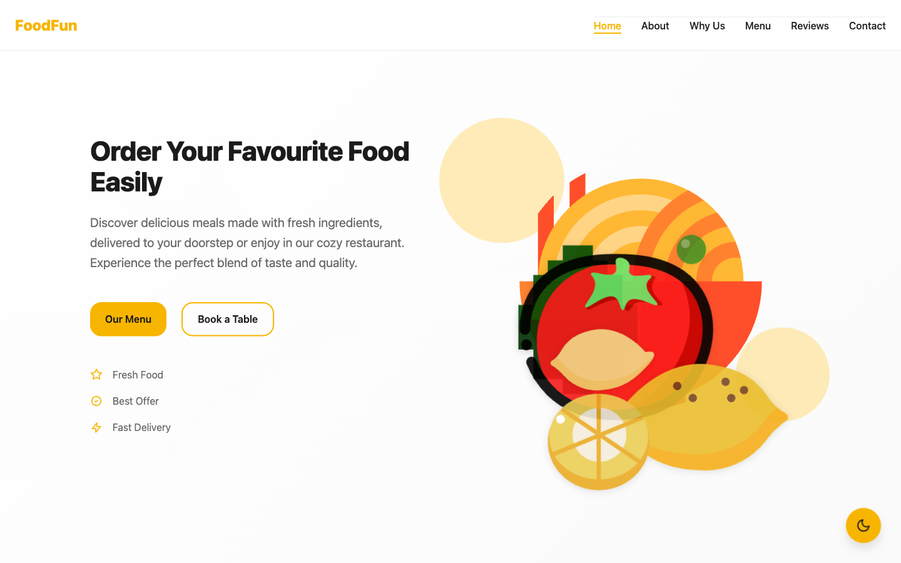
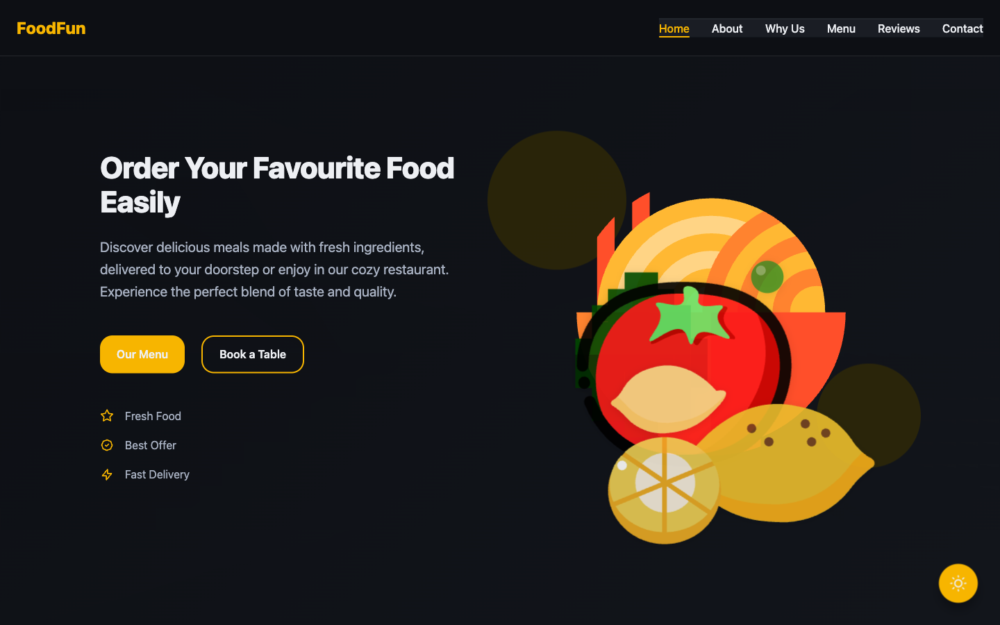
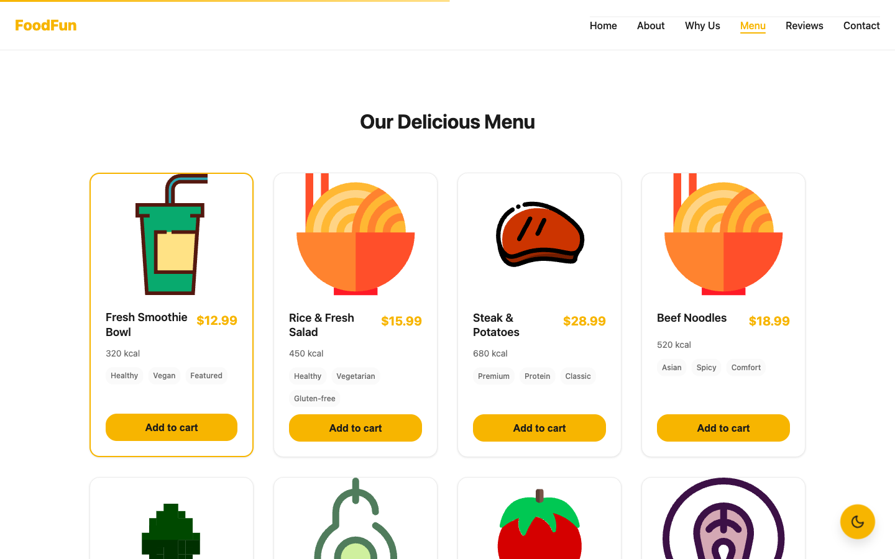
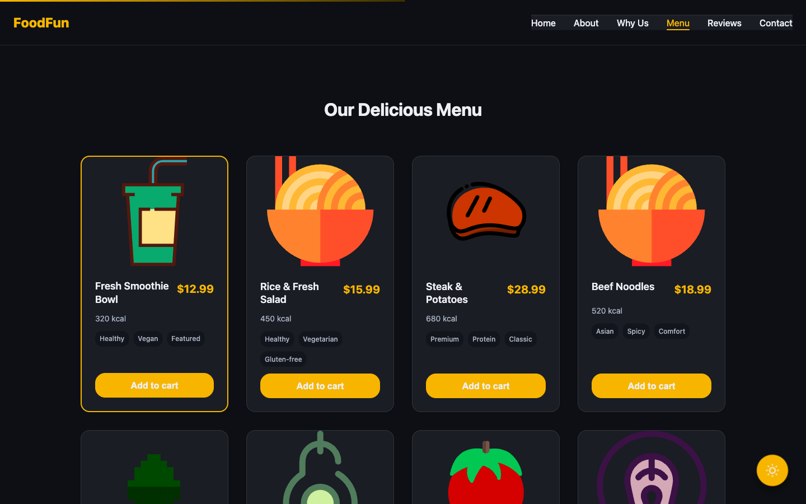
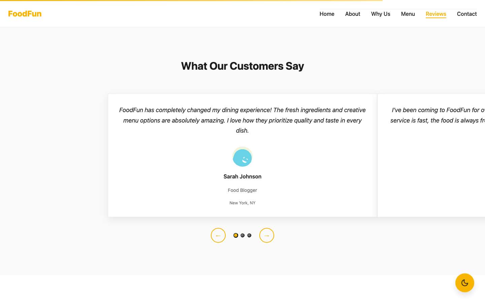
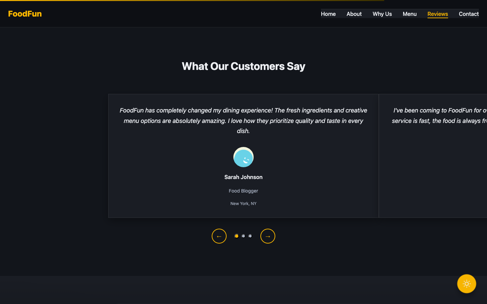
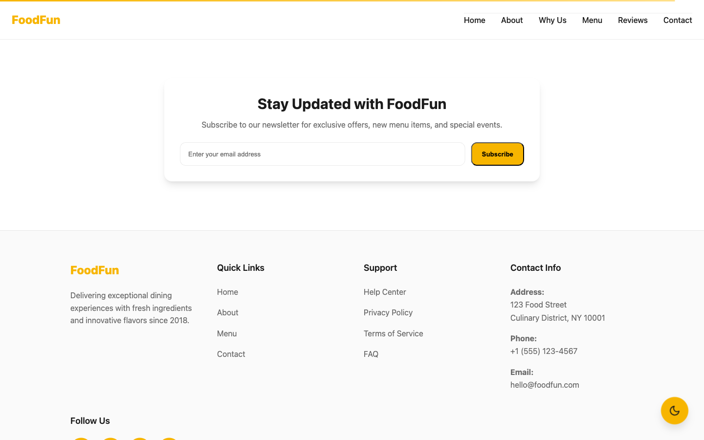
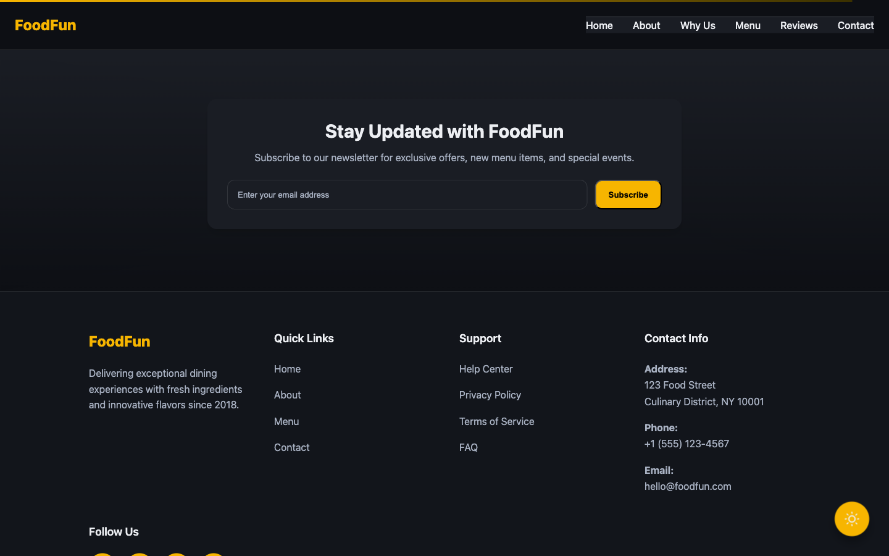

# 🍽️ FoodFun - Modern Restaurant Landing Page

[](https://mutlukurt.github.io/foodfun/)
[](https://vitejs.dev/)
[](LICENSE)
[](https://pages.github.com/)

A modern, responsive restaurant landing page built with **Vite**, **Vanilla JavaScript**, and **CSS**. Features a beautiful design with dark/light theme support, interactive components, and mobile-first responsive design.

## ✨ Features

- 🎨 **Dark/Light Theme** - Seamless theme switching with localStorage persistence
- 📱 **Mobile-First Design** - Responsive across all devices (320px - 1440px+)
- 🍽️ **Interactive Menu** - Beautiful food cards with hover effects and CTAs
- 💬 **Testimonials Slider** - Auto-playing customer reviews with pause on hover
- 📧 **Newsletter Signup** - Functional subscription form with toast notifications
- 🎭 **Smooth Animations** - CSS transitions and scroll-triggered reveals
- ♿ **Accessibility** - WCAG compliant with focus management and keyboard navigation
- 🚀 **Performance** - Optimized images, lazy loading, and efficient CSS
- 📱 **PWA Ready** - Service worker and manifest for app-like experience

## 📸 Project Screenshots

### Homepage
**Light**

**Dark**


### Menu
**Light**

**Dark**


### Reviews
**Light**

**Dark**


### Subscribe
**Light**

**Dark**


## 🛠️ Tech Stack

- **Build Tool**: [Vite](https://vitejs.dev/) - Fast build tool and dev server
- **Frontend**: Vanilla JavaScript (ES6+ modules)
- **Styling**: Modern CSS with custom properties and Grid/Flexbox
- **Icons**: Custom SVG icons and illustrations
- **Deployment**: GitHub Pages with gh-pages
- **Development**: Hot Module Replacement (HMR) and live reload

### Key Dependencies
```json
{
  "vite": "^5.0.0",
  "gh-pages": "^6.3.0"
}
```

## 🚀 Getting Started

### Prerequisites
- Node.js (v16 or higher)
- npm or yarn

### Installation

1. **Clone the repository**
   ```bash
   git clone https://github.com/yourusername/foodfun.git
   cd foodfun
   ```

2. **Install dependencies**
   ```bash
   npm install
   ```

3. **Start development server**
   ```bash
   npm run dev
   ```
   Open [http://localhost:5173](http://localhost:5173) in your browser

4. **Build for production**
   ```bash
   npm run build
   ```

5. **Preview production build**
   ```bash
   npm run preview
   ```

6. **Deploy to GitHub Pages**
   ```bash
   npm run deploy
   ```

## 📁 Project Structure

```
foodfun/
├── 📁 src/
│   ├── 📁 components/          # React-like components
│   │   ├── About.js           # About section component
│   │   ├── Hero.js            # Hero section with CTA
│   │   ├── MenuCarousel.js    # Interactive menu grid
│   │   ├── NavBar.js          # Navigation component
│   │   ├── Testimonials.js    # Customer reviews slider
│   │   ├── ThemeToggle.js     # Dark/light theme switcher
│   │   └── ...                # Other components
│   ├── 📁 styles/             # CSS organization
│   │   ├── theme.css          # Theme system & variables
│   │   ├── global.css         # Base styles & utilities
│   │   ├── components.css     # Component-specific styles
│   │   ├── mobile.css         # Mobile-first responsive
│   │   └── utilities.css      # Utility classes
│   ├── 📁 assets/             # Images, icons, SVGs
│   │   ├── 📁 screenshots/    # App screenshots
│   │   ├── plate-*.svg        # Food plate illustrations
│   │   ├── avatar-*.svg       # User avatars
│   │   └── ...                # Other assets
│   ├── 📁 utils/              # Utility functions
│   │   └── themeManager.js    # Theme management system
│   ├── 📁 data/               # JSON data files
│   │   ├── menu.json          # Menu items data
│   │   └── testimonials.json # Customer reviews data
│   └── main.js                # Application entry point
├── 📁 public/                 # Static assets
├── index.html                 # HTML template
├── vite.config.js            # Vite configuration
├── package.json              # Dependencies & scripts
└── README.md                 # This file
```

## 🎨 Design System

### Color Palette
- **Primary Brand**: `#F7B500` (Warm Yellow)
- **Secondary Brand**: `#FFE08A` (Light Yellow)
- **Text Colors**: 
  - Light: `#1B1B1B` (Dark Gray)
  - Dark: `#EDEFF3` (Light Gray)
- **Backgrounds**:
  - Light: `#FFFFFF` (White)
  - Dark: `#0D0F14` (Dark Blue)

### Typography
- **Display**: `clamp(28px, 3vw, 48px)` - Hero headlines
- **Headings**: `clamp(20px, 2.2vw, 32px)` - Section titles
- **Body**: `16px/1.65` - Readable content text

### Spacing & Layout
- **Container**: Max-width 1200px with responsive padding
- **Grid System**: CSS Grid for layouts, Flexbox for components
- **Spacing Scale**: 8px base unit system (0.5rem, 1rem, 1.5rem, etc.)

## 🌐 Live Demo

**Visit the live site**: [https://mutlukurt.github.io/foodfun/](https://mutlukurt.github.io/foodfun/)

## 📱 Browser Support

- ✅ Chrome (latest)
- ✅ Firefox (latest)
- ✅ Safari (latest)
- ✅ Edge (latest)
- ✅ Mobile browsers (iOS Safari, Chrome Mobile)

## 🤝 Contributing

1. Fork the repository
2. Create a feature branch (`git checkout -b feature/amazing-feature`)
3. Commit your changes (`git commit -m 'Add amazing feature'`)
4. Push to the branch (`git push origin feature/amazing-feature`)
5. Open a Pull Request

## 📄 License

This project is licensed under the MIT License - see the [LICENSE](LICENSE) file for details.

## 🙏 Acknowledgments

- **Vite** team for the amazing build tool
- **CSS Grid** and **Flexbox** for modern layouts
- **SVG** for scalable graphics and icons
- **GitHub Pages** for free hosting

---

<div align="center">

**Built with ❤️ using Vite + Vanilla JS**

[⭐ Star this repo](https://github.com/yourusername/foodfun) | [🐛 Report issues](https://github.com/yourusername/foodfun/issues) | [📧 Contact](mailto:your-email@example.com)

</div>
